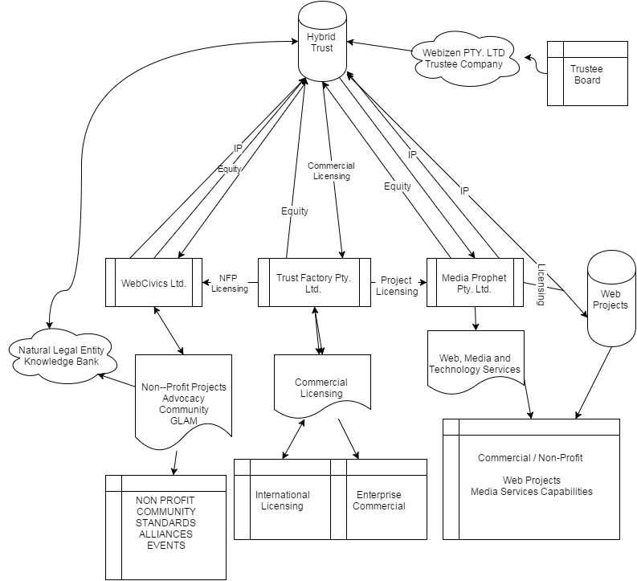
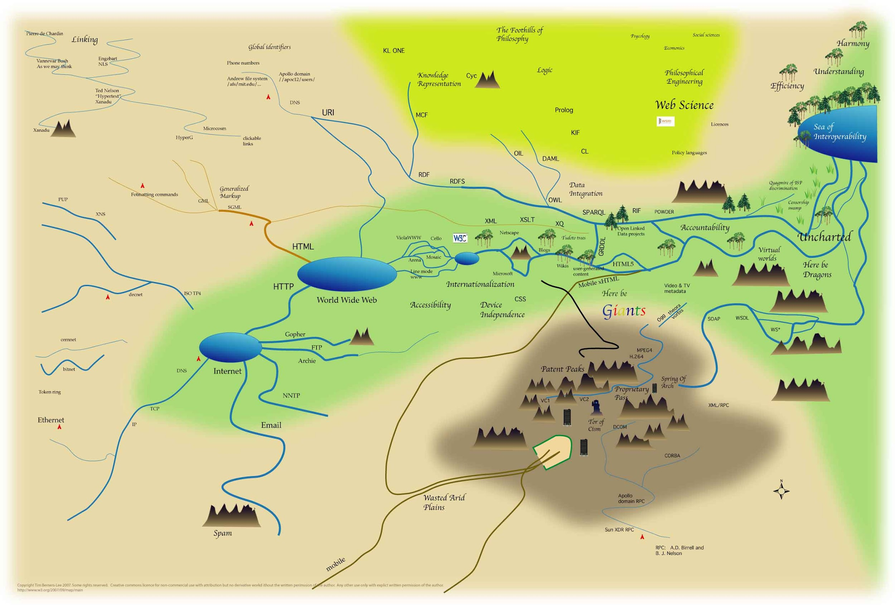

## **Australian Knowledge Banking**

**Industry Establishment**

**Presented by:** **Timothy Charles Holborn** **("holborn")**

**Trading As:** **WEBIZEN**, **WEB CIVICS**, **MEDIA PROPHET**, **TRUST FACTORY**

**Document authored by:** **[Timothy Charles Holborn](https://www.linkedin.com/in/ubiquitous/)

SourceDate: [22nd November 2015](https://docs.google.com/document/d/1UZqygx0OpNbguvq-UNiryr9l7SQxJZ0auj8Dx15EJMU/edit?usp=sharing)

#### BACKGROUND
A unique opportunity exists to support the establishment of knowledge banking infrastructure, where legal entities store their own data. Applications in-turn address user-data storage, rather than storing user-data in the same database as the application, as is the current standard method for web-applications. Tim Berners-Lee labelled this concept 'socially aware cloud storage' in his 'design notes' webpage dated 17-8-2009. The concept is not new. It has been the subject of world-wide technology standards development since about 1998, Tim Holborn independently commencing work on this area from 2000.

*The underlying principle can be simply explained by using an addressbook example. The principle is that i do not need to send you my details; I should only need to send you a link. In-turn that link is the web-address for a page, where my details are maintained by me. When i
change my details, it will then be automatically updated because your reference is not the data provided to you on a temporal basis, but rather, the link, and access permissions pertaining to that link; that will obtain my details whenever you use the link.*

From a technology standpoint, one of the most challenging obstacles has been how to support the creation of the underlying technology solutions in an inclusive manner as to support the management of patent-pools, dependencies with other software and software vendors (ie: browsers) and global awareness of the underlying architectural models that in-turn decentralise the opportunity for developing marketplaces (storage, website creation), identity, application and knowledge management systems.

Timothy Holborn, author of this document, started developing his "knowledge banking" concepts in 2000 with great naivety. Inspired by the work of Sir John Carew Eccles, who won a nobel prize for his work on synaptic nerve-cells. Apparently Tim Berners-Lee was inspired also by the way the brain worked, whilst he commenced building the 'semantic web' concepts with others, which has now been rebranded 'linked data'\...

His first investment opportunities that purported to support the idea of knowledge banking, addressed the opportunity from an operator\'s perspective; in-turn applying some of the earlier data-silo, portal or 'aggregation' strategies in an age before iTunes. Tim felt this in-turn demonstrated an array of difficulties that existed around how difficult it was to help people own their own data as individuals, rather than as shareholders of a company where the data would reside. Unbeknownst to Tim at the time, Tim Berners-Lee, and a network of others had established the W3C and were working on the same principle concepts as
their vision for the future of the web.

The W3C has become the global membership organisation where open web-standards are produced and made available worldwide subject to the w3c technology license terms. Incumbent upon the members of the W3C is to furnish any and all patents and intellectual property contributed to a technology standard working group, in-turn the W3C became a cradle for producing the web technology standards including those required as to produce a knowledge-banking capability in a manner that ensures systems can be produced in a manner where natural legal entities may own their data, rather than a service provider involved in the storage and accessibility of data, or a patent holder who may otherwise demand a royalty in relation to the perceived human right.

Over what has become a 15 year journey, the next steps are to create an organisation designed to bring these technologies to market as to deliver the foundations of a knowledge banking industry. The incorporation and structure of this social-enterprise strategy incorporate and provide continuance of an ideologically distinct journey aiming to furnish humanity with the right to own and operate intellectual property, in the form of data. Overtime, this mission has been found to be the subject of shared-values with many, incredibly talented participants around the world and together, we hope, Both the
societal and commercial impacts of this opportunity are vast.

## INTRODUCTION
The principal architect of this opportunity is Timothy Holborn where the primary goal is to establish a Knowledge Banking Platform, the basis for the development of a new-industry servicing the needs of citizens data. 

The Knowledge Banking Platform is supported by global standards, such as open web-standards and those used for payments and identity systems. These systems enable legal entities to own their data whilst significantly enhancing the manner in which data may be used, for virtually limitless reuse potential, through web applications developed by anyone, that are designed to interoperate with these socially-aware cloud-storage dataspace systems via use W3C standardised methods. W3C is the World Wide Web Consortium, who is responsible for WWW software technologies such as HTML, XML, RDF and the array of others that make the web, function. The systems enabling the means to store data on behalf of the legal entity the data is about. In this way, they produce a user-experience that is similar to desktop computing, where the user owns the documents produced in a word processing package without damaging the rights of the company who made the word-processing package itself. Knowledge Banking allows this basic concept to be applied to web-applications, internet devices and systems that interact with WWW.

These systems support both open-software formats and closed-software formats to be stored.

When Open-standards based Software Formats are used (ie: RDF), the data become available to any application that is designed to read it, subject to the data owner's permission.

It is Holborn's plan to form and establish a capability in Australia that incorporates the means to support international collaboration by way of a method of alliancing that is capable of managing some very complex issues surrounding the role taken by local territories around
data, as the law would otherwise apply in the physical domain by way of traditional concepts of property (intellectual or otherwise). This strategy requires international support for engaging participation on an international level, whilst building a viable business locally that is capable of servicing our sovereign needs and opportunities through early-commercialisation of internationally developed technologies; and as an important counterpart to how this may be achieved, define means in which the business systems themselves are innovated as to rewards those contributing value; whilst also, ensuring local management of systems that store and/or govern, the personal and private data of local legal entities.

The overarching mandate involves establishing, building, testing and refining the means in which people safely and securely store their data where the terms of use for that data-storage service better reflect the situational needs of the legal entity (ie: local choice of law, privacy, et.al) and that the data be stored in a manner that enables standards & permissions based re-use, via linked-data technologies. Save local-law enforcement and related laws, a user should not be compelled to share their data with any 3rd party other than where subject to do so by law; and that it is hoped in such circumstances, any use be auditable via means of digital accountability. Furthermore, where disputes arise that may be aided with respect to available data, it is hoped our systems of law may be improved substantially by ensuring data may become more accessibility to the legal entity, at low cost, within and pursuant to their local system of justice, for the purpose of aiding citizens with access to justice.

## CORPORATE STRUCTURE

In-order to drive the economics and take-up of this new internet platform functions, a corporate structure is to be established. 

The Objective of this structure is to support the development of a knowledge banking industry, that supports the interests of people (citizens) ahead of more narrowly focused for-profit enterprise structures. 

The 'hub' of these activities relate to the development and operation of systems that will be storing data on behalf of users in a manner that is secure and able to securely be used with applications designed to use the data, for specified use, stored by the user.

Non-profit activities are extremely important and will be managed by way of 'Web Civics'. Commercial applications and licensing is the function of 'trust factory' with a particular operational specialisation built upon the use and application of credentialing technology as it applies both independently and in conjunction with semantic analytics and other complex linked-data related capabilities. The development of hypermedia products and services that use these technologies are envisaged to require internal leadership even though the bulk of future revenues are expected to be obtained by way of licensing via Trust Factory. To support these internal product development activities, 'Media Prophet' will be used to develop and support 'hyper-media' application development, program support and related products and services for multitude of commercial and non-profit opportunities which he believes will provide revenue generating capabilities for the group in the near-term.

These products and services have an secondary impact in that if successful, they would lower the effective cost of media distribution whilst maintaining and enhancing media-industry economics; whilst simultaneously delivering a proof-of-concept for the knowledge-banking
infrastructure by providing compelling opportunities for advertisers to deliver targeted advertising; in a manner that does not require sharing of user-information mandatorily, with advertisers.

**BUILDING AN ECONOMIC PLATFORM & MARKETPLACE**

The objective of establishing the Knowledge Banking Platform is to enables marketplaces to build applications that use the infrastructure where the paradigm is based upon users owning their data, not website owners/operators.

One of the biggest problems most experience has been in obtaining a critical mass of users where the development of compelling applications that use data from a service that stores it on behalf of users (not silos) becomes useful. The implication of this undertaking is of course
that the user-centric silo, would contain more information than any independent silo would otherwise; and as such, the security becomes of higher concern overtime.

The works are based on technologies that are often called linked-data or semantic web technology. unbeknownst to many, these technologies already power many of the worlds largest websites and most users web-experiences with their favourite applications. Whilst the number of existing uses and users is vast; some of the biggest users of the underlying
technologies includes most (if not all) of the major search-providers and social-network sites. These market leaders have in-turn developed two sets of infrastructure capabilities as required to service 'Web 2.0' based technologies. They are the data-storage layer, where user-data is stored (as distinct from a users floppy disk) and the application layer (that before internet, used floppy disks for sharing data). The Works sought seek to target the data-layer, in a manner that makes it easy for all web-companies to use W3C Standards as to ensure their applications may be made compatible with systems that enable users to store their own
data.

Differentiators from the existing market-place includes;

**Web 2.0**

Existing Users store User-Data and in-turn obtain a license for that data, as required to operate their business (that provides both applications and cloud-storage services (often free of end-user fees).

**Commercial Use**

a.  Existing services have very few tools that support citizens generating an income directly, in relation to the use of their data.

b.  In most circumstances, the service of storing data for citizens is provided freely, subject to a 'terms of service' agreement that in-turn aim to ensure the company storing the data may make a return on investment relating to the service of 'free storage' provided to end-users of their online products.

c.  data provided may be used commercially by the provider subject to the terms of service agreement. The use-cases may includeidentifying where people are at any occasion, or when they sleep, or who they communicate with, or what types of things they like to interact with, or what their heart-rate is, or the contents of their correspondence; or, via web-agents, information that is created by linking all of those data-points together as to create an 'insight'. These systems may be digitally mapped as to run predefined scripts that may augment online (related) life experiences.

d.  That these 'insights' are often more easily available to a commercial agent, than it is to the citizen. Even if the data may be useful in areas of civics; such as,
i.  Justice, as to proof someone did not commit a crime
ii. Proof of identity - to aid someone who may be in dire circumstances, such as refugee, homelessness, or unconscious/incapacitated circumstance for health related purposes, for instance...
iii. Health
iv. Economic Benefit, as may be derived via the sale of proportionally licensed works
v.  Social-Sciences and Statistics (ie: social-trends relating to human rights, welfare, et.al.).

> *These sorts of data-use applications available for citizens to use these service are often less supported than those for commercial agents for advertising purposes, or for purposes that enhance the overall data-holdings about individuals made useful for other commercial purposes, subject to the terms of service agreements.*

e.  Particular use of Algorithms on international basis; with unintended vulnerabilities and/or consequences.
i.  Elections
ii. Cultural considerations (nudity, gun-laws, et.al)
iii. Costs, revenues and rights for citizen content/data (economic impacts)
iv. Misappropriated semantic reasoning, including but not exclusive to the application of these technologies upon personalised social-media prioritisation and related experiences

Many of these issues may be attended to socially, through the application of an underlying platform where users store their own data.

Technically, this has been called a 'dataspace', which when using W3C Linked-Data related standards enables permissions based reuse of the dataspace, stored in any well-defined data-spaces platform.

It is envisaged that these forms of proposed capabilities have the potential to impacts (Australian) GDP in many very significant ways, from influencing advertising and media distribution markets as to support local industry growth; through to the development of science and sociology through the availability of statistics, and the growth and development of Knowledge Economy by enabling the means in which data is stored in a manner that improves the attribution of digital property (data) to the legal entities who created and/or own that data. However, the predicate to this envisaged social-benefit comes down to a set of decisions that need to be made and acted upon, whereby the capability to enable (natural) legal entities to store and build influence over the economic derivation of their data; as governed by the jurisdiction that directly relates to their domicile, becomes important to those governing the governed, digitally or otherwise.

The systems proposed are based upon global, open-standards that Timothy Holborn has become involved in developing. Institutions such as the World Wide Web Consortium (W3C) provide patent protection in association with many of the largest companies and institutions around the world for the underlying technologies that enable data to be stored in reusable
formats, through existing standards developed including but not exclusive to Linked-Data, RDF, JSON-LD, etc. The community in-turn develop products that are protectable intellectual property providing the capacity to provide investor returns and defensible intellectual property for products and services developed upon these open-standards.

Whilst these standards are open which ensures humanity is able to author and produce software and/or documents on the web; the software systems in which these technologies form an embodiment (usable software) can and are owned by the individuals and groups who produce them and subsequently license them by various means. Holborn has been working on unique systems and related strategies, collaborating with others, seeking to build, deliver and offer a viable solution for supporting knowledge economy, using his specific methodology, developed over the past 15 years - exploring thoroughly the business systems issues throughout industry and government sectors as part of the underlying research leading to his particular method and system for solutions definition. The outcomes of this work form the basis of the opportunity and how it may be applied as to build and deliver a successful business within a relatively short-timeframe, at relatively low-cost.
Underpinning the commercial structure is a mandate to enhance support for the development of Web-Sciences and related apparatus, achieved through participation with standards groups, their members and the broader community.

This provides the opportunity for industry enablement through forging new business systems that may be tracked via digital accountability systems, enabling new viable forms of engagement methods for collaboration, licensing of existing technology, trade and cooperative development and commercialisation arrangements for new technologies.

Over approximately the same period of Holborns work, others around the world have shared his broader vision, quite independently, which has led to Holborns involvement in progressing global, open-standards, including those for payment and credentialing instruments, which now involves many world-leading organisations.

The strategic commercial opportunity is to forge a path to extend these collaborative, international relationships to build, produce and deliver knowledge banking infrastructure using the now available standards, whilst applying those standards using a business systems formula market territories where information being disseminated is 'low-stakes', as to
support global research and development activities that overtime seek to contribute towards resolving significant, global economic and societal issues.

Due to the nature of support provided by Holborn to these communities, the manifest method in how he has assembled a strategy for attending to these global problems and his know-how and continued involvement with supporting the resolution of problems within this domain; an array of highly advanced technology products are being made available to him, for the purposes of implementation, often on particularly friendly terms.

The next stage of Holborns Project is to bring together the works into a corporate structure whereby a team, brought together by holborn, may work collaboratively to bring to market the opportunity for individuals to own their data and for these systems to be made throughout the market-place.

Whilst the technologies are well developed, some still undergoing standardisation work and others still, envisaged by holborn, potential candidates for standardisation work, the corporate structure Holborn has defined with the assistance of experts, aims to deal with a number of critical threats and opportunities relating to the realisation of a marketplace where users store their own data.

Therein; The operational structure performs a number of critical outcome orientated tasks.

Web Civics is operationally a non-profit entity that is devoted to the development of web-science works surrounding a market shift between the institutional storage of data, to that of one where data is stored on behalf of citizens, by institutional service providers. Beyond this more simple measure, other tactical and civic orientated works continue to be supported by web civics including works within the domain of open-data, organisational policy, events and means in which to showcase the use of linked-data for humanitarian causes and the hope to auspice works by innovators and on behalf of non-profit endeavors, to improve understandings, perform R&D and deliver social outcomes.

Trust Factory is an international licensing capability that supports the commercial and non-profit use of credentials, semantic analysis and other advanced computing systems capabilities, supporting market demand via consulting and licensing, in-turn empowering integrators and enterprise with the capacity required to deploy advanced knowledge-banking related systems, in a manner that is supportive of the rights of humans.

Media Prophet is a Media Services organisation that strategically develops and delivers Web-Projects.

## ABOUT WEB CIVICS

[[Web Civics]{.underline}](http://www.webcivics.net/) aims to be a leading organisation, established in Australia dedicated to Web Science, as is applied to Civics projects. Established by [[Timothy
Holborn]{.underline}](https://docs.google.com/document/d/1WuztAUPQ0usSbXhL1YhIrpkiDDzs7HDXAZ0VFpqCj4w/edit?usp=sharing), working on the concepts surrounding decentralised web was commenced in 2000, now contributing to decentralised web and 'linked data' activities with W3C related communities internationally.

Web Civics aims to be a world-class contributor to the Knowledge Economy. Through its works as a Non-Profit, supported by practical hands-on programs of work establishing network infrastructure to support local markets and empower enterprise. Media Prophet and Trust Factory support the engine-room of an international Civics Agenda. The entities are initially planned to be operated in Australia with an International Alliance of market leading professionals, organisations, and webizens committed to the development of the Web and its beneficial application in all efforts directed towards egalitarian democracies and the way in
which all of humanity may be supported in growing to fullest potential.

Rich Media Distribution accounts for a significant portion of Internet infrastructure use. In the SandVine report for the second half of 2014[^1], The Peak Period Traffic Composition of Internet use in Asia Pacific shows significant percentages of Real-Time Entertainment.

The technologies used by the group aims to support individuals owning their data. This is a significant paradigm shift, which in-turn needs to be tested in the real-world at scale, in relation to 'low stakes' data. 
Timothy Holborn believes that a viable and strategic opportunity exists to deliver infrastructure in a manner that can scale to support the data-needs of all Australians, by starting to build the platform with Community Media.

This Community Media solution can then be extended into other industries such as heritage, digital libraries, archives and later Free to Air Television, digital receipts, loyalty, metadata, personal storage of sensitive data and establishment of other online 'cloud storage' services such as 'social networking' and the issuance of verifiable credentials for use by legal entities in their affairs.

All of these services can be delivered in an evolutionary manner that is supported by W3C Web-Standards, based upon the application of Linked-Data.

## Scope of Opportunity

The scope of this opportunity is large. Very few linked-data experts exist throughout the world, even though these technologies already power major websites and infrastrastructure. Segmentation and practice management is required to achieve potential growth in participation within the field of the opportunities and the development of those
opportunities.

## AN INTRODUCTION TO LINKED-DATA

Linked-data is a new type of database. Prior to Linked-data, relational databases were the traditional means for computing systems to manage data records. Arguably, linked-data provides one of the greatest advance in communications technology since the advent of Internet Protocol and the World Wide Web.

Linked-Data based databases are designed for the internet, enabling the storage of records across the web in a decentralised manner, using ontologies to establish the database function; in effect, creating the database like functionality without the need to centrally store
information by one particular entity. In turn, this means the database is web-scalable.

Linked-Data supports separating the data from the content and the application. This in turn enabling data to be used by a plurality of applications. Linked-Data technology brings about new implications in how we create, share, append, store and trust data and data services.
Systems supporting Linked-Data technology are already deployed in many of the largest platforms.

### What is Web Science?

The Concept of [Web Science](http://en.wikipedia.org/wiki/Web_science) is an emerging profession, providing a structure of study and education. The concept was introduced early to leading edge web practitioners in a presentation about [Network Theory by Tim Berners-Lee](https://www.youtube.com/watch?v=u_2YWiaPJ6A).
He described the concept of 'philosophical engineering', incorporating psychology, social sciences, and economics into a specialised field of Web Science.

Fields of interest include;

-   Galleries, Libraries, Archives & Museums
-   Social Applications
-   Public Data
-   Health Data
-   Legal Considerations pursuant to the Use of Data
-   Human Rights considerations with regard to data relating to or denoting a person
-   The merit of owning and being in control of your data

## GLOBAL APPLICATIONS 

**THE OF TECHNOLOGY AND METHODS FOR GLOBAL APPLICATIONS**

### Supporting Humanity through Web-Science Outcomes

A significant undertaking is underway globally, to provide internet to humanity as a human right. In practical economic terms, this means attributing factors of justice to human societies whilst supporting their rights to democratic systems, systems of justice and local governance, whilst also supporting factors surrounding international discourse on how these objectives can be met through the use and availability of data.

These types of works include consideration of how Technology is made accessible as well as;

- The provision of Identity Instruments that improve means in which global issues such as the management of displaced people or natural disasters are managed,
-   The Provision of Economic Instruments (bank accounts, knowledge bank-accounts),
-   Broader access to Knowledge and Education,
-   Computationally solving humanitarian problems that are currently either scientifically impossible or would be done in a manner that may result in less-favourable commercial terms.

Further opportunities exist as follows;

### Enhancing Human Development

- Support for Liberal Arts - Advancement of Human Knowledge,
- Supporting Australia's Participation in discourse about Web Science, globally,
- The opportunity to contribute value-based judgements and considerations with regard to societies, including but not exclusive to acceptable use of data and its application in society,

- Support for tools and apparatus that provide meaningful support for systemic, short-term, civilisation wide-change that are occurring in relatively short-timeframes.

### New Economic Platforms

- Define means to reward socially beneficial behaviours,
- Support Pseudo Anonymity (not everyone needs to know everything),
- Support vast demand-related changes to workforce (particularly affecting women and children),
- Meaningfully support shift in utility, development and scripture of Intellectual Property Principles,
- Improve Energy Efficiency. Support the identification of wasteful energy use, and develop methods to improve the value of energy as attributed to the environmental impacts of human development and prosperity,
- Support accessibility to knowledge, sharing of commercial outcomes based upon contributions towards the economically derived outcomes built by humans and the materials available to them as legal entities and decision makers.

Establishing Web Civics in Australia as defined provides a globally relevant pillar of capability that is extensible for growth and global prosperity. Many of these works are produced by leading scientists and Web Science experts, who produce open-standards that are furnished with patent protection from many of the world\'s largest companies and institutions. However many of the most significant contributors do so on a philanthropic basis. Web Civics and it's investment and operational vehicles, Media Prophet and Trust Factory provides an innovative organisational structure that seeks to contribute towards the delivery of solutions for these types of global issues, whilst furnishing local markets with means to attend to matters of civics, governance and commercially beneficial use of linked-data related technologies and technology enabled knowledge economy infrastructure.

### SOME EXISTING PROJECTS

Principal architect Timothy Holborn has been developing works for many years. These works, and those related, form the basis of the opportunity, contributing the know-how, access and international capacity to deliver a commercially and socially sound business opportunity. Works incorporating the use of Linked-Data include but are not limited to;

| MEDIA PROPHET                                     | COMMUNITY MEDIA                                               |
|---------------------------------------------------|---------------------------------------------------------------|
| Community TV                                      | Interactive TV Systems for Free TV Broadcast Markets          |
| Local Media                                       | Semantically Enabled Local Media Platforms                    |
| GLAM (Galleries, Libraries, Archives and Museums) | Semantically Enabled Digital Libraries                        |
| Life. Be in It.                                   | Community Sports, Social-Health, Demonstrator App.            |
| Local Advertising Services                        | Upload, Offer, Approve Distribute Advertising                 |
| 3D Capture and Display                            | Capture and catalogue free-viewpoint media                    |
| 3D Heritage                                       | Support delivery of First Indigenous Heritage Platform        |
| 3D Encyclopedia                                   | Like a photographic encyclopedia, just 3d assets / scans      |
| TelePresence / Video Communications               | TeleConferencing, Telepresence, Real-Time Clinical Grade.     |
| Semantic Reasoning                                | Advanced Network Intelligence (Info/Knowledge/Wisdom)         |
| Pet Management App                                | Health and Wellbeing Management for Pets                      |
| Measurements App                                  | Easy Method to Communicate Personal Measurements              |
| Events Systems                                    | A Data-Services Platform for Artists, Events and Patrons.     |
| Trust Factory                                     | Enterprise Markets                                            |
| Media Prophet Projects                            | Commercialisation of technology                               |
| Digital Receipts                                  | Standards based retail lifecycle ontology and digital receipt |
| Credentials                                       | Web-Standards Project Credentialing Platforms                 |
| Web-Payments                                      | Web-Standards Project Payments Platforms                      |
| Business Website Technology (Data vs. Interface)  | Linked-Data-Warehousing Technologies                          |
| Metadata Retention Support                        | LDP based Telecommunications Systems                          |
| Socially Aware Read/Write Cloud Storage           | LDP based Cloud Solution for Telcos & Enterprise              |
| LDP / Credentials Support Contracts               | Supporting the delivery of LDP/Credentials Technology         |

Each Project has multiple commercialisation pathways, inter-relating from a technology platform / capability perspective. .

### WEB SCIENCE - DATA OWNERSHIP

Data ownership is arguably amongst the more complex areas of internet policy development.

Traditionally, many have attempted to apply existing Intellectual Property and Copyright Law to the function of data, with limited success. Data Rights have challenged many aspects of society, including software and media industries, for decades.

Internet connectivity and the World Wide Web continues to develop coverage for every known thing. Whilst the aims are Every Human, Every-Second, Every-Thing; transcribed to a form of data, the scope of application of law, such as 'data rights', is yet to be understood.

Increasingly pervasive sensor data, services, and documents continue to develop far more rapidly than the discussion, and with fewer and fewer significant providers, considerations such as 'choice of law', remain without a significant response as the underlying concepts of 'data rights', has no tangible meaning to society overall.

Far broader than the issues of accessibility and application of data; the data relationship to life and persona, whether personally available or stored by private and government controlled data storage systems, will provide transformational learnings virtually for any form of profession, governance or study. Whilst we all seek to define the elusive concept of safety, a question we should all be asking is: what about data rights. How does this data support me.

Whilst the debate about data is relatively new, precedents include society's struggle with the application of copyright law since the advent of personal computers.

Internet, and 'Linked-Data' extends existing demands upon these unaddressed issues.

Principles of copyright are a foundation of a knowledge economy. Article I, Section 8, Clause 8 of the United States Constitution, "The [Copyright Clause](http://en.wikipedia.org/wiki/Copyright_Clause) ", states that copyright law was "To promote the Progress of Science and useful Arts, by securing for limited Times to Authors and Inventors the exclusive Right to their respective Writings and Discoveries."

Progressively, Internet linked data connects to the way people live, work and play. Legally, Linked-Data is often described as 'metadata', whilst applied asymmetrically or commercially; to track, transcribe, store and share data. Data being generated as part of the core function
of devices, their sensors, and the logging / economic systems connected to them, providing the means to communicate and store documents, information, servicing security technologies in an effort to form 'best practice' for web compatible software, services and solutions.

Herein, amongst the most critical issues emerging is that of data ownership and how the practice of using technology may attenuate concepts surrounding 'data rights', Human Rights, Citizenship and Democracy.

**Projects - Web Science Projects**

Web Science projects are projects where workable products are produced to prove particular ideas works, and to discover new problems. The Development of **Personal DataSpaces** is complex. It involves defining systems that separate the data-layer from the application layer, being that the assets incorporated into a user-experience are owned by a variety of other parties that can be reflected by the systems themselves. Trust Factory is established to support Authentication systems, yet the principles of how this is obtained is a Civics agenda
more than a commercially focused endeavour. We care about the people, and at times, laws will not exist to protect them.

Web Science projects will also include managing the development of Ontologies that support human rights, sovereignty and citizenship related functional aspects. Web Civics supports causes such as the availability of public data use-cases for science, education and social-development.

**Media Prophet**

Media Prophet produces Media Technologies, engaging community on a civics basis for the development of media related capabilities. Media is defined in its broad concept, being anything that is made available for public consumption, the way in which it is done, and the apparatus available to do so, via various mediums.

**Governance**

Governance of Media Profit is primarily derived by Web Civics, however other stakeholders are part of the governance for the Media Prophet enterprise.

**Alliances / Partnerships**

-   Education / Universities
-   Media Companies
-   GLAM sector participants

**Trust Factory**

Trust Factory was specifically set-up to support Credentialing Technologies. Credentialing Technologies support identity and permissions related systems. It is important these technologies are used well, not poorly. Trust Factory helps to manage the availability, delivery and support for credentialing related technologies.

Trust Factory assists organisations in structuring their data to the new world standards of Linked Data, where all organisation-wide data, regardless of how or where it's stored, is interconnected, enabling complete analysis and processing from customer, suppliers through to operations. It also enables seamless secure connection of data with any external consumer and business systems worldwide. Organisations under Linked Data standards results in better understanding of their customers and all facets of operations, which improves productivity, builds stronger relationships and opens up new areas for business growth.

Trust Factory uses best of breed open standards and has access to some of the best Linked Data specialists both locally and around the world in areas of:

-   Incumbent database restructuring.
-   Deploying various ontologies (eg RDF).
-   Implementing W3C semantic queries.
-   Identity & credential solutions.
-   Server, desktop, mobile, cloud, print and point of sale deployments.
-   Metadata retention.
-   Analytics & Data intelligenc

## DATA OWNERSHIP, SOCIAL WEB

**(POC RWW → LDP - STAGE 1)**

**LDP Based Data Storage Platform**
The LDP based data-storage platform is a replacement for CDN and Data-Storage for users. It replaces Akamai or similar CDN technologies whilst providing support for Legal entities storing their own data in a manner that allows that data to be used by applications authored to support specific W3C technologies..

This platform is at the core of the product and service offering made available via Trust Factory / Web Civics.

The key differentiator is that this platform enables legal entities to store their own data which is in-turn available for use by any authenticated application that has been authored using W3C Standards to query data-storage locations across the web (multiple legal entities) to
form a user-experience.

As this platform is brought to market, applications are authored for specific opportunities to bring the solution to scale, supporting and enabling use of the platform by legal entities whereby participants store their own data, sharing it with others (social web) upon a system
of permissions.

**BACKGROUND**

Works within the W3C are complex and multi-stakeholder. One particular group, led by Tim Berners-Lee and MIT based contributors (MIT license applies to code) have been working on the social-web. [https://www.w3.org/wiki/Socialwg/2015-03-17](https://www.w3.org/wiki/Socialwg/2015-03-17)

These works in-turn relate to solving the problem of Social Network
Silos: [http://www.w3.org/DesignIssues/CloudStorage.html](http://www.w3.org/DesignIssues/CloudStorage.html)

SoLiD is explained:  [https://github.com/linkeddata/SoLiD](https://github.com/solid/solid-spec/tree/1f7c32f0d40c757260c6a066bf62c52b6884a5e4) (Note: historical Link)

**THE MARKET PROBLEM.**

These technologies demonstrate to highly technical people, how applications can be separated from data that is consumed / interoperable with Applications through the use of W3C standards technology.

This means, people can store their own data, and any application can be authored to use data as acquired from users and their data-storage locations, no-matter where it's stored on the web (decentralised). This data may be called 'metadata' by some professionals influencing internet policy. The problem is, that without improving the user-experience for
how these systems work; it becomes nearly impossible to demonstrate how the web works; and therefore,

-   How legislation may be better applied
-   Why it is important to support a marketplace of local data-storage providers (knowledge banks)
-   Where opportunities exist for Web-Development
-   How these technologies provide a paradigm shift opportunity
-   How the paradigm shift relies upon the basic premise, that data = property.

It is incredibly important we own our data. This basic expectation is not supported by existing Social Network Silos. The project mandate is to encapsulate, update and integrate existing works as to deliver a user-experience that can be understood by various stakeholders. The
Solution will need to be presented at an event that is to be announced in future.

**THE R&D PROBLEM**

Whilst the MIT and related teams have been producing an array of applications, they're very difficult to use. The Authentication method is also constantly discussed, and whilst TimBL has an array of very strong opinions about it, it's likely the pragmatic solution will be that a variety of methods will be used depending on the use-case. At the moment, the use of WebID-TLS in these application examples contribute towards a poor user-experience that is unfortunate.

**TOOLS AND EXISTING WORK**

An interface package has been purchased and used when starting to produce:
[http://dev.webcivics.org/](http://dev.webcivics.org/)

This is based on a UI Toolkit, where the Providers Demo:
[http://pages.revox.io/dashboard/latest/html/#usa](http://pages.revox.io/dashboard/latest/html/#usa)

An earlier example:
[http://mediaprophet.org/ux_KB/](http://mediaprophet.org/ux_KB/)
A quickly defined diagram outlining the identity related consequences is outlined on the front page.

**NEW FUNCTIONALITY**

**MANAGING PERMISSIONS**
The Permissions management system will allow a user to set a group by defining tags. It is likely these tags will be predicated by @@ or \# however that will need to be defined. A group has an array of permissions. You may have a limitless number of group permissions, which in-turn accumulate in providing permissions to any particular entity.

**SIPHON EXISTING DATA, CREDENTIALING AND DATA RIGHTS ONTOLOGY**

The data-rights ontology will denote considerations such as copyright, storage, reuse, choice of law and other explicit terms of use privileges set-out by users in relation to the use of their data. Credentials will be used to authorise applications and other various tasks surrounding
the management of trust. Data is managed by Social Network Silos. When defining means to aggregate users-data to a user's-data-storage location, it is important to ensure data is not misused by an application making a request for access.

**PHOTOS (and Videos)**

Video Transcoding servers are in-production and major works around video are out of scope in the first instance. The work will include the need to produce Image Management tools (resize, metadata extraction/assertion, derivatives, et.al).

**EXISTING WORKS**

The Social-Web related working group have started building independent applications. Importantly, these applications all run as client-side javascript, enabling the application itself to be portable.

Each application use particular formats of RDF to communicate to 'dataspaces' particular types of content, stored by legal entities on their servers. In-turn, the systems use access control to present information to the end-user from all the various data-sources that the
user is authenticated to access...

The list of applications and related source-code repositories are listed below;

| Sign-Up (account Creation)                                               | http://linkeddata.github.io/signup/             | https://github.com/linkeddata/signup         | Linked Data                  |
|--------------------------------------------------------------------------|-------------------------------------------------|----------------------------------------------|------------------------------|
| Profile Editor                                                           | http://linkeddata.github.io/profile-editor/     | https://github.com/linkeddata/profile-editor | Linked Data                  |
|                                                                          |                                                 |                                              |                              |
| Search for People                                                        | http://webizen.org/                             | https://github.com/linkeddata/webizen        | Linked Data                  |
| Then Add people you know via the Profile Editor or the Address Book app. |                                                 |                                              |                              |
| Address Book                                                             | https://linkeddata.github.io/contacts/          | https://github.com/linkeddata/contacts       | Linked Data                  |
| Create a Microblog                                                       |                                                 |                                              |                              |
| MicroBlog                                                                | http://cimba.co/                                | https://github.com/linkeddata/cimba          | Linked Data                  |
| App                                                                      | URL                                             | GitHub                                       | Creator                      |
| Instant Messaging                                                        | http://webid.im/                                | https://github.com/melvincarvalho/webid.im   | melvin carvalho              |
| Clipboard                                                                | http://melvincarvalho.github.io/clip/           | https://github.com/melvincarvalho/clip       | melvin carvalho              |
| File Manager                                                             | https://linkeddata.github.io/warp/              | https://github.com/linkeddata/warp           | Linked Data                  |
| Schedule                                                                 | http://linkeddata.github.io/app-schedule/       | https://github.com/linkeddata/app-schedule   | Linked Data                  |
| SpreadSheet                                                              | http://linkeddata.github.io/spreadsheet/        | https://github.com/linkeddata/spreadsheet    | Linked Data                  |
| Calendar                                                                 | http://rww-apps.github.io/ld-cal/               | https://github.com/rww-apps/ld-cal           | Linked Data                  |
| Issue tracker                                                            | http://timbl.rww.io/test2/skin2.html            | Same as location                             | TimBL                        |
| Locator App                                                              | https://findme.rww.io/                          | same as location                             |                              |
| Edit (save not working)                                                  | http://mediaprophet.github.io/HTML5RWW-testing/ | github.com/mediaprophet                      | TimH/Someone (noted in code) |
| Video App                                                                | https://melvincarvalho.github.io/video/         | https://github.com/melvincarvalho/video/     | Melvin Carvalho              |

**SECOND STAGE**

The second stage of the project will be defined after the first part has been successfully completed.

**DOCUMENT INNOVATION**

As part of the interface application technologies, a solution inspired by Xanadu Space document format system is envisaged to provide a meaningful opportunity to interact with knowledge systems. A collaborator is involved with Xanadu, which has been the work of Ted
Nelson [https://en.wikipedia.org/wiki/Ted_Nelson](https://en.wikipedia.org/wiki/Ted_Nelson)

This project shifts the way in which documents are produced and viewed.

VIDEO:
[https://www.youtube.com/watch?v=En_2T7KH6RA](https://www.youtube.com/watch?v=En_2T7KH6RA)

DEMO:
[http://xanadu.com/xanademos/MoeJusteOrigins.html](http://xanadu.com/xanademos/MoeJusteOrigins.html)

The document format will in-turn require RDF to store document and reference formats, by providing links.

# MARKET RESEARCH

The economic implications of establishing 'knowledge banking' at an industrial scale is believed to be enormous; Key Economic Factors include,

**Transparent Economic Drivers**
Transparent Economic Drivers are circumstances where commodities or valuable intellectual property is provided but not identifiable from an economic standpoint in relation to the commercial use of that property.

**Knowledge Economy**
The interconnected, globalized economy where knowledge resources such as trade secrets and expertise are as critical as other economic resources.

**TransNational Flows of Economic Resources**
Properties, assets and other forms of economic resources being licensed and/or used on an international basis with unintended consequences.

**Accessibility to Knowledge for Education, Scientific and Social Endeavours**
The use of Public and/or Private Data for specified purpose as to support the advancement of humanity.

**Accountability Systems and access to Justice**
Use of technologies that aid accessibility to the Rule of Law by all legal entities which in-turn shifts marketplace behaviours through improvements to accountability systems that in-turn reduce risks relating to behavioural concepts such as 'plausible deniability', 'legal strategy' and/or 'strategic marketing'.

These technologies can also be applied to track provenance, purport association and permissions in relation to objects.

**Appropriation of digital economic resources**

Economic Participation requires at a minimum, identity, banking and property resources.

## ADVERTISING, LOYALTY AND DIGITAL RECEIPT
Advertising, Loyalty and Digital Receipts Systems use data-spaces to create relationships between businesses (incorporated legal entities) and people (natural legal entities).

Users store information and define how to use that information in relation to an array of particular use-cases that support our economic relationships with others.

## WHAT ARE CREDENTIALS?
A ***credential*** is a qualification, achievement, quality, or piece of information about an entity's background, typically used to indicate suitability. A credential could include information such as a name, home address, government ID, professional license, or university degree. The use of credentials to demonstrate capability, membership, status, and minimum legal requirements is a practice as old as society itself. The potential use cases are innumerable, but common important examples are represented here in the domains of:

-   **Education** - where academic credentials and co-curricular activities are recognized and exchanged among learners, institutions, employers or consumers.
-   **Workplace** - where an applicant's certified skill or license is a condition for employment, professional development and promotability
-   **Civil Society** - where access to social benefits and contracts may be based on verifiable conditions such as marital status
-   **Payments** - where the legal right to purchase a product depends on the verifiable age or location of the buyer
-   **Identity** - where an entity presents credentials to prove their identity or qualification
-   **Ownership** - where an entity presents proof of ownership of a particular asset or a right to perform specific operations against a resource. Examples are ownership of securities that entitles the entity to dividend payments or the authority to transact on an account.

## **Goals**
A number of W3C member organizations are proposing the creation of a new standardization activity around credentials on the Web with the following goals in mind:

- **Interoperability** and **Portability.** We want to ensure that an open credential can be used by as broad of a range of organizations as possible. We firmly support the notion that a recipient of a credential should be able to store, archive, and migrate credentials throughout their lifetime with relative ease.
- **Scalability.** The credentialing solution should be usable by the 3 billion people using the Web today, and the 6 billion people that will be using the Web by the year 2020.
- **Verifiability.** The veracity of claims made by a credential should be verifiable using the credential itself.

- **Privacy Enhancing** and **Recipient Controlled.** We want a system that protects the privacy of the individual or organization using the credential by placing the recipient in control of who is allowed to access their credential.

- **Extensible.** Our desire is to construct a foundation where different industry vertical-specific solutions can be built without unnecessary central coordination.

- **Accessible.** The credentialing solution should be accessible and therefore also usable by the 10% of the world population with disabilities.

- **Patent and Royalty-free.** We are building public infrastructure whose growth should not be limited by patents and royalties. Credentials affect everyone and the technology to create them must be open and free.

## SEMANTIC REASONING SYSTEMS
Semantic reasoning systems identifies unstructured data, such as text or contour information in images, or phonics in sound; and references that text with semantic web or structured data about how to represent that data in different ways. In this way, it can translate Voice to Text, or the term Tim Berners-lee: [http://mediaprophet.github.io/fusepool-uduvudu/](http://mediaprophet.github.io/fusepool-uduvudu/)

### MEDIA MARKET OPPORTUNITIES
A key opportunity identified is community media. Spectrum Efficiency is becoming increasingly important, and whilst older legacy systems continue to use traditional DVB related technologies, IP based alternatives offer far more flexibility whilst also embodying an array of new issues that are arguably poorly considered by local markets, over medium to longer-term timelines. Within Europe in the mid to late 00's, a standard called 'TV-Anytime' first emerged, later progressing to form and build the now established HbbTV Standard, that has recently become HTML5 compatible with HbbTV v2; and is furnished with an accelerated
opportunity for incumbent markets to commercialise an advanced, linked-data enabled HbbTV v2 Content package and standardised distribution format that can offer both extraordinary targeting and privacy, through the use of linked-data enabled dataspaces. Whilst debates may take place about DVB-T2 or HEVC enabled TV's, the majority of citizens can be enabled today through HDMI dongles and mobile devices. The Data-Volume involved at scale, paths the way

Yet where the real economic value is really attributed to this perceived market strategy; is in the capacity for targeted advertising to be produced and delivered to targeted audiences, without privacy or significant cost implications. Modern technologies enable the production
of Web-enabled interactive content cheaply and distribution costs of targeted advertisements can easily compete with the fee structures currently supporting major social-networking advertising alternatives. Herein, the biggest problem appears to be education and therein; The go to market approach may be best started at the grassroots, where local
communities through local infrastructure such as radio stations, are supported in delivering valued media services for their communities, including the ability for community members to participate by providing content, and being supported by technology that assesses their skills as to aid employment outcomes.

## COMMUNITY MEDIA
A number of systems will need to be developed in-order to support privacy solutions around the development and delivery of community 'hypermedia' (TV).

Whilst the application development program itself is not specifically designed to be extensible at this stage; the extensibility of Linked-Data Systems, where users store their own data, has virtually limitless reuse potential.

### USE CASE: Community Media, Education, and Content Syndication. 
Within an indigenous 'outback' community, the local radio station has set-up their hypermedia capability. Their website offers an array of local media, that is available for syndication with local community tv providers and other news-outlets. Their system works by taking a percentage of the revenue attributed to the content they curate with local community members.

They've got a shed they've turned into a historical society, storing valued historical artifacts that are important to their community. People in the community have memories of life, and stories that relate to those artifacts.

The radio station provides the opportunity members of the community to produce a content package about the heritage artifacts. They work with elders in the community, producing some video where elders tell their stories with historical context. They create a 3d scan of the object, and also write both some information about it that is collated into their heritage collection, in addition to some articles that are used for their local radio broadcast and their local news website.

Some of those materials become syndicated for by other broadcasters nationally.

Advertising and syndication revenue provides a percentage of revenue back to the creators of the work, and the local radio station who helped produce it, ensuring it was suitable and accurate.

The people who contributed to it, are provided credentialing information that also shows they've learnt the skills involved in undertaking the task. This contributes to their employment and educational / skills records.

People involved with running the station and their online environments accumulate information about their activities. This information can be used by local businesses to assess whether they can find the local talent needed to help them with their business. The business wants to produce some advertising materials. They've managed to find the skills locally, and the local radio station is able to syndicate the media for use across the network, helping the business target their advertising and ensure it is 'ready for tv'\...

**NOTES**
In this use-case, the practice of community media provides both the capacity to identify and process local media, as well as supporting community development and community engagement. NANODEGREES[6]: Nano-degrees are emerging in the marketplace as a means to provide 'qualification' for particular skills that may be constituents of broader formal qualifications. These systems store 'metadata' about the user in the users account. As such, these systems in-turn provide the means for users to understand and communicate their skills, talents and interests using data, that improves the means in which they may find
employment.

## WEB CIVICS EVENTS - OVERVIEW
It is important that Web Civics holds and supports events that will examine Web-Science from practice-led examples, demonstrating how these systems can be used, supporting the development of know-how within the community to leverage the technologies on their own merit for their own projects, and/or how to work within the Web Civics (and related entity)
community, in defining projects and means for using these technologies and related Web Science knowhow, for specified tasks.

The Event is being established as a means to entertain the experiences of particular Web-Science fields and the application of linked-data within the community.

The Web Civics event format facilitates public information sessions between members of the public, with local and international experts. Each event carries an overarching theme, made-up of a multitude of 'acts' delivered in a manner similar to that of other 'shows'.

Whilst the format of the show is subject to the wishes of the show presenter, it is expected that the audience be provided an opportunity to participate by way of questions and answers or other means that support audience engagement. The production style will encourage
presenters both locally and abroad to prepare presentations to an audience in a dynamic and engaging manner. In-turn, this brings the 'show' to geek. The production methodology is set-up in such a way as to support these forms of thematics. The idea is to make the experience fun and engaging. The way I believe this can be achieved, is through the means, methodologies and process undertaken to define the event.

**SCHEDULE METHODOLOGY**
The format theory is that we should be able to more effectively communicate concepts at low-cost using google hangouts or similar technology; however timezones are still important.

Given most International leaders in these areas are located either in the US or the UK/EU, the theory was that an all day event may in-turn provide more options for a region that needs to deliver public outcomes with GMT+10 in mind operationally... The below is an outline put
together, which is subject to change and development. Your input is very much welcomed. Opening / Introductory session: an introduction to Web-Science.

### Thematics: The Event Experience
The thematics of this event seeks both to examine web-science through an edutainment experience, designed for community leaders; as well as doing so quickly, in a means that encourages people to go home and find those 1 hour long youtube videos explaining things in more detail...

Patrons should leave thinking - *geez, didn't know web 3.0*[^2] *which means linked-data, was already powering the web - we've got to get onto this web-science stuff, find out how to use linked-data in our organisations...*

In-turn, helping to stimulate questions / demand, for linked-data capabilities in new infrastructure projects in addition to illustrating considerations surrounding Web Science concepts (inc. sociology, economics, etc.) when defining strategy and deliverables. In turn, it is hoped this should help provide substance to civics projects as a means to solve problems that are yet to be identified and/or properly addressed or considered, prior to large-scale commercial implementations; such as,

*The Knowledge Economy is upon us, who is capable of participating equitably, upon informed choices, delivered by market based, non-exclusive, mechanisms, upon a platform that supports access (from an accessibility standpoint) to justice, as is defined by my community.*

In the preparation, it is suggested that each of the presentations showcase particular areas incorporating the utility of Linked-Data, whether or not it is implemented as yet in that field and/or sector. The presentation will be workshopped locally, with feedback provided to the
international expert (for review) prior to the event. The International expert is then invited to provide global context and perspective from the global policy, activity and support points of view. In-turn, this facilitates an environment where local presentations are supported by
International context through an on-stage collaboration.

The audience then engage, Having been prepared (pre-production) with online overviews, the opportunity to define questions both before and during the event (due to short-timeframes, and event flow, we're trying to keep it simple by vetting in-session questions)). Pre-Production will include video work where the subject is briefly explained.

**TECHNICAL DELIVERY OVERVIEW**
International experts are invited to participate via an online teleconferencing solution. A curated live-feed will be provided back to the international participant, as to ensure they can see and interact, whomever they are speaking with. The sessions are short, and the purpose
is to highlight the merit of education, investment and development within the field of web science and linked-data; which is achieved through highlighting an array of practical use-cases, solving civic problems and/or civic problems that could be explored through the
WebCivics lens.

**LIVE BROADCAST**
The event is broadcast live on the web. Vision Switching infrastructure should be capable of providing 'ad-insertion' into the program stream. This in-turn offers advertising opportunities for event sponsors. During the lunch break, Ideally, other media can be shown to the external
audience whilst those on-site are participating in the break.

**TECHNICAL OVERVIEW**
The Web-Civics event format facilitates public information sessions between members of the public, with local and international experts. These sessions are recorded and made available for public use. Each event carries an overarching theme, made-up of a multitude of 'acts'
delivered in a manner similar to that of other 'shows'.

Whilst the format of the show is subject to the wishes of the show presenter, it is expected that the audience be provided an opportunity to participate by way of questions and answers or other means that support audience engagement. The production style will encourage
presenters both locally and abroad to prepare presentations to an audience in a dynamic and engaging manner. In-turn, this brings the 'show' to geek. The production methodology is set-up in such a way as to support these forms of thematics.

**LIVE BROADCAST**
The event is broadcast live on the web. Vision Switching infrastructure should be capable of providing 'ad-insertion' into the program stream. This in-turn offers advertising opportunities for event sponsors.

**ABOUT DATA RIGHTS**
Data Rights is a complex, multi-faceted, policy discussion and emerging issue. Web Science is a lens designed for longer-term, more complex method to enable engagement, research and policy development for this, and many other web related policy discussions.

Local and International experts will be invited to participate in the panel locally and via TeleConferencing technology. The panel will start the conversation by introducing emerging issues pertaining to data rights, which will then be interactively discussed with the audience.

**Sub-topics include (but are not limited to);**
-   Data Accessibility 
-   Asymmetry
-   Sovereignty / choice of law 
-   Security 
-   Reuse  & Accessibility 
-   Legal Innovation
-   Storage
-   E-Contracts
-   Encryption
-   Digital Ledgers
-   Credentials  
-   Proprietary vs. Open Standards

**RISK ANALYSIS - Risk Management**

**VIRTUALLY LIMITLESS REUSE.**
These dataspaces will in-future enable the safe and secure storage of information in much the same way banks provide secure storage of funds. These systems are already in-place, powering major social-networks, search, platform and online application providers. As the data is formatted in standardised formats, data can in-turn be used in virtually limitless ways to redress and/or address an array of issues from the lack of public statistics, through to ways of using complex data to solve problems like cancer.

However if the ways in which commercialisation of these technologies is not appropriately managed, the fundamental social-systems manifestly supporting society by way of 'the rule of law', systems of democracy and other relevant precedents can be threatened. In many ways these systems of governance are already threatened. Increasingly data is becoming a
mandatory imperative for the support of justice and therefore also, society. Current systems are collecting an enormous amount of data, and in the majority of circumstances doing so via a terms-of-service agreement with end-users, that in-turn requires them to submit their
data to the site pursuant to terms where the jurisdiction of use is declared to be by way of contract 'choice of law' methods, offshore.

Whilst we seek to change this fundamental issue, the means in how data becomes owned by the legal entity that data pertains to; also results in the need to address business systems that have not been forged.

**SUPPORT**

Web Civics / Media Prophet / Trust Factory provides enterprise Linked-Data solutions that can radically change what is possible for client projects. We are interested in supporting a nurturing relationship with our key go to market partners and alliance members that in-turn may provide assistances to your customers in meaningful ways, whilst ensuring they do not breach boundaries around the use or misuse of these technologies. As much as we seek to work with you in delivering projects, we hope in-turn you may seek to work with us in
developing your own.

These principles of cooperation, collaboration and fair-value assessments bring together some of the foundational concepts required to be distilled and supported operationally, as to ensure access and support of leading minds internationally, whose assistances will be
critical to the success of this venture.

**TERMS OF ENGAGEMENT**

The Business models around how these systems work. As part of the scope of works, it is expected that access to leading minds around the world will be part and parcel of the job.

Some areas of these works are not standardised at the W3C Level. This in-turn requires collaboration and debate with various parties. Technologies that enable, secure and provide safety for users in storing and owning their data are not fully implemented as yet. Elements of this endeavour will be embodied in the work, which is in-turn collaborative, cooperative and funded by someone. It is important that we do not misuse or degrade the opportunities for humanity or investors into these projects. Therein, elements of how these undertakings are made will be cognisant of relationships first and foremost and the way in which people can work collaboratively, with good governance (established by WebCivics) to undertake these tasks whilst balancing various needs for society.

## KNOWLEDGE ECONOMY - WEB CIVICS FRAMING PAPER

FRAMING PAPER

**About W3C**

W3C was established by Sir Tim Berners-Lee using a set of particular ideological decisions that he made to produce the web we know. He has communicated these decisions, including his future vision of the Web from a standards development, or rather "network theory" perspective at Annenberg Networks Network seminar[^3].

On the 6th of September last year, Jeff Jaffe replied to a query I had in relation to philosophical concepts pertaining to the growth of W3C and how it is legally structured, with the following;

\"W3C is not a legal entity. W3C staff exists at four research universities (MIT, ERCIM, Keio, and Beihang) and legally it is a series of contracts that binds the universities and member organization to work together on web standards.\"

As emboided by domain registration information for w3.org[^4] and w3c.org,[^5] the leadership of TimBL is cemented by an array of unstructured, verifiable credentials. An elder in our field, his views, along with others, guide our principles for work within W3C Groups as we
seek to provide what might be a remarkable influence to the world through credentials and payments means and methods.

Internet, has reached a level where access to it is debated as a human right[^6]. The link between internet and economics is inextricably linked. It is arguably impossible to produce anything without inherent, ideological definitions woven into a specification, whether that be done via conscious, subconscious or unintended decision making processes. Now therefore the production of this document attempts to provide discovery related materials that may empower those charged with the responsibility for defining these technologies to make inclusive and well considered judgements in relation to this technology definition process.

**W3 CG Web Payments Vision Statement: Tooling apparatus**

The W3 CG was established by Manu Sporny[^7], who envisaged a path for his work, entitled 'payswarm', whereby he sought to continue that work through an endeavour that sought to produce a standard with W3C. In 2014 a decision was made to separate the identity verification related work to a separate Community Group entitled 'credentials[^8]'. Throughout
this period initial considerations were debated surrounding the concept of 'data rights'[^9]. Similar resources for these types of considerations include filters provided by TimBL in his 'design issues'[^10] notes; which may in-turn be combined with web-theory entitled web-science[^11][^12] to identify methods in forming governance around a relatively new area of practice-theory[^13].

The objectives embodied accumulatively, yet not exclusively, by the Open Credentials and Web Payments initiatives seek to define global open-standards for trade over the Web.

**Global Economics and W3C practice theory**

W3C standardisation processes start within a W3C community Group (CG) where the activity is not a W3C Standard nor is it on the W3C Standards Track.

W3C Community Projects combine members through contributor license agreements[^14] that form the bedrock for the production of ideas into opportunities that may in-turn develop further. Should these projects gain sufficient support, works developed from within a community group may in-turn develop further in-line with W3C Processes[^15] through the
formation of an Interest or Working Group to continue development of the works produced within a community group, towards the establishment of a W3C Standard.

One of the criticisms made in relation to W3C is that few individual contributors participate within IG and WG groups. Whilst the W3C Is investigating the development of an individual membership[^16], current means include participation as an 'invited expert'. Therein, where the
project advances from the notation of code within documents as to ensure browser compatibility of web-pages, to more socially sophisticated concepts such as 'payments' and 'credentials', which is inextricably linked to identity, the importance of non-corporate membership presence becomes as important as the representation of federal/state or academic institutions. The current list of participants for the W3C Payments IG
is listed online[^17] and as the initiative moves forward, we hope the initiative will be supported by a comprehensive representation of stakeholders..

The Payments and Credentials program of work seeks to apply W3C Practice therum, considerate of how the forum applies particular capacities to technology production for particular purpose; with an open, technical means for supporting economic development. Critically, these technologies specifically related to the web-use of linked-data[^18] and
related technologies.

The call has been made for the Web-Payments CG to contribute towards the 'vision statement' for "Web-Payments: Technical Architecture[^19] Whilst simpler outlines may include statements such as 'to be compliance with Law[^20]', or that inline with broader W3C
statements; we seeks to deliver global consensus upon a set of  web-standards that seek to support 'one web'[^21]; the meritorious endeavour of building an open-framework for web-commerce is particularly complex and as such this paper attempts to identify some of the
underlying principles compatible with the field of endeavour.

**PRINCIPLES FOR DEFINING OUR SHARED VALUES**

General knowledge depicts our global sphere governed by economic values.

We accept the format whilst seeking to enhance its capacity to uphold rulings of law; noting, that with this form of global development more advanced concepts such as Purchasing Power Parity[^22] become directly relevant to the utility of these technologies for global development and sustainability; alongside many others.

In many regions populations suffer from a lack of clean drinking water, shelter, health and education or indeed energy. It is often argued that means to solve these problems are resourced through economics. 
Participation in the banking sector is not currently a universal[^23] and whilst access to internet in developing nations is growing[^24], noting the influence of UN Sustainability Goals for universal internet access and the influence of smartphone technologies[^25], the capacity
to deliver low-cost accessible services for access (and economic participation) is considered 'at the core of a future development agenda'.

Many regions, but not all, support citizenship through state values such as that of 'social security'[^26] for those who cannot find work or are otherwise incapacitated. Yet equally, a new trend of unauthorised or unrecognised commercial use of works without compatibility to legal precedent such as Fair Value[^27], in-turn affecting the core of the economic platform in which internet access itself is provided. An early definition of rights with regard to 'information' as protected by the convention of 'copyright', was entered into the US Constitution circa 1787[^28].

Used and developed since times before computing whilst the principles are generally well understood, the application of these principles to new embodiments such as software and digital documents whether embodied in a single file or stored in an obfuscated format such as a database entry (that is capable of publishing the same information as a file or document) are amongst the many difficulties reflected upon as members of the group seek to forge a path forward.

With specific regard to 'copyright', Creative Commons[^29] has already undertaken a great deal of the legwork in defining a means and method for describing and/or notating ownership and license for intellectual property made available on web. These licenses are in-turn applied to data whether it be delivered from a database or a machine/human
readable, standalone file or document.

Yet the demonstrated concept of the applicability of copyright in one in a myriad of web-scale problems that uniquely affects private data, as distinct from secret or public data services.

The W3C is intrinsically involved in globalization[^30], and therefore well positioned to take-on the job of defining the HTTP technology needs to support payments and related service formats. Payments relates directly to identity and related claims, due to international laws
requiring identity in association to commerce.

Upon the basis that we agree economic participation is a necessary human right; and that, such considerations should be include but not be exclusive to the embedded considerations such as 'fair value'; and that, precedents of law should apply regardless of whether the rule is applied upon affairs carried out in physical presence of other counterparts or via electronic means, such as over internet;

and that through the application of particular technologies such as HTTP Signatures, Encryption and Linked-Data tooling the traceability is significantly enhanced; and that whether or not interfaces are provided to a singular or multitude of participants, these technologies aim to support private sharing; now therefore, upon which principles do we
define this standards and what constitutes conformance.

**SHARED VALUES**
Through the use of a web-enabled, linked-data payments platform the capacity to track and deliver highly advanced financial services capable of analysing to high-levels of granularity transactional relationships. In-turn the development of these works seek to be guided by a set of principles capable of acceptance across the community.

Much of our global economic environment stem from the historical works notably commencing from the production of the Magna Carta in 1215[^31]; notably stating,

*"No free man shall be seized or imprisoned, or stripped of his rights or possessions, or outlawed or exiled, or deprived of his standing in any other way, nor will we proceed with force against him, or send others to do so, except by the lawful judgement of his equals or by the
law of the land. To no one will we sell, to no one deny or delay right or justice."*

Later, in 1948 the UN General Assembly adopted the Universal Declaration of Human Rights[^32] document, as a result of the experience of the Second World War. The text of this document, in-part outlines the following human rights principles,

-   inalienable right to life,
-   liberty and security of person,
-   prohibition of slavery,
-   recognition as a person before the law and equality before the law,
-   protection from arbitrary interference with privacy, family home or correspondence in addition to honour and reputation,
-   the right to own property and not be arbitrarily deprived of his (or her) property
-   the right to social security
-   The right to work
-   Free choice of employment
-   equal pay for equal work

*"Nothing in this Declaration may be interpreted as implying for any State, group or person any right to engage in any activity or to perform any act aimed at the destruction of any of the rights and freedoms set forth herein."*[^33]

Supporting documents were later developed, including the International Covenant on Economic, Social and Cultural Rights[^34] that reinforces an array of virtually ubiquitous agreements lead by heads-of-state providing a foundation of fundamental economic principles available for reference.

**"Data Rights" and/or Privacy Principles**

In early 1978 a new ad hoc Group of Experts on Transborder Data Barriers and Privacy Protection was set up within the OECD, instructed to develop guidelines on basic rules governing the transborder flow and the protection of personal data and privacy. This work, under the chairmanship of the Honourable Mr. Justice Kirby, Australia, and with the assistance of Dr. Peter Seipel (Consultant),was carried out in close co-operation with the Council of Europe and the European Community. On the 23rd of September 1980 this work resulted in the production of recommendations by the council concerning guidelines for governing the production of privacy and transborder flows of personal data[^35] These
guidelines served as the first internationally agreed upon set of privacy principles, and were updated in 2013[^36]

Definitions within the text of the OECD Privacy Framework[^37] includes a definition reference of "data controller" who is "*a party who, according to national law, is competent to decide about the contents and use of personal data regardless of whether or not such data are
collected, stored, processed or disseminated by that party or by an agent on its behalf."*

**DATA STORAGE OPTIONS ENHANCED WITH LINKED-DATA**

Linked-Data enables decentralised storage of information, decoupling applications from the underlying user-data stored in a framework that can be read and written within that application framework. A useful resource showcasing the function of these types of decentralised data-storage works includes

-   **Cross Cloud**[^38] where w3c related works seek to provide standards for read-write online storage

-   **Google drive apps**[^39] which demonstrates a similar concept as is applied to the storage of application related data, to a user's google drive.

-   **OERPUB**[^40] where EPUB files can be edited[^41], storing the files on GitHub

Beyond the storage of data by users, Linked-Data is used to provide context to data as to provide an extensible, web-scale database platform through decentralised notation through the use of linked-data technology. Examples of data output from a data-silo include Mr
Coles[^42], YASIV[^43], and socilab[^44].

These examples demonstrate to some-degree the availability and reusability of data in a fairly basic manner. More advanced use cases should include considered by reviewing the function of semantic reasoning systems like redlink[^45] or schema.org[^46] related implementations in search-engines, such as google's search[^47] that integrated "*Google\'s \"Knowledge Graph\", Hummingbird is aimed at making interactions more human --- capable of understanding the concepts and relationships between keywords."*

A recent sophisticated example of how Linked-Data related technologies may provide derivative action, the ways in which particular ideological processes applied social-media networks has been examined in relation to election related communications. In an article by Wired.co.uk entitled 'Facebook's political 'echo chamber' is your fault, not theirs'[^48] the
relationship between the 2015 General Election and personalised media services was examined, quoting '2011 TED talk by activist Eli Pariser' (who) 'summed up the potential dangers of this system: \"if algorithms are going to curate the world for us,\" Pariser said, \"then\... we need to make sure that they also show us things that are uncomfortable or
challenging or important\"."\.... \"Each algorithm contains a point of view on the world. Arguably, that\'s what an algorithm is: a theory of how part of the world should work, expressed in math or code.". In an article by gizmodo the crux of the issue is outlined in the headline 'Could Facebook Change the Outcome of the General Election?"[^49] In an
article from Gigaom.com the concept that Facebook is commercially targeting both utility within the field of elections, whilst denoting 'routine experiments with the structure of the newsfeed'[^50], a field of web-science that has been the subject of apology by Facebook as
documented by the guardian, Due to the public outcry that became of secret psychological experiments on users[^51].

Web-Services are often offered for use upon agreement via a contract, often called 'terms of service'[^52]. Therein, considerations such as 'choice of law'[^53] become equally important depending on the use-cases of any particular deployment. When continuing the examination of the implications of a case-study focused upon social-networks, it is worth noting many of the terms of service agreements, including but not exclusive to; Facebook[^54], Google[^55], DropBox[^56], Apple[^57], Twitter[^58] have selected various districts within California as their
choice of law. This has implications upon the platform or service provider\'s interpretation of issues such as copyright, amongst other things.

Semantic technologies cannot accurately identify, on every occassion, whether the all information provided is accurate or correct, in-turn if users do not have access to data about them, they are in-turn unable to contribute or validate that information which may result in unintended consequences. Credentials and Payments works are designed to be used in
association with other emerging web technologies to deliver new internet enabled social-capacity. As we enter an age of 'Internet of Things' and Cloud Software, so many things will communicate an array of different formats of data that can be translated to linked-data, with an array of privacy and economic development related consequences. Group activity in
Credentials and Payments, within this field of emerging Issues, are aligned with solving some of the critical issues in this area.

**The Application of Copyright Precedent.**

Article I, Section 8, Clause 8 of the US Constitution, known as the Copyright Clause[^59];

*"To promote the Progress of Science and useful Arts, by securing for limited Times to Authors and Inventors the exclusive Right to their respective Writings and Discoveries."* When these form of Copyright principles were established the embodiment of work was not transcribed
digitally as it is today. The Creative Commons[^60] project developed an international framework for applying copyright to digital resources in a manner that is human and machine readable. To examine a use-case, a resource may be supplied with a mixture of free use and paid usage terms. The free-use provisions may be supported by creative commons
notation[^61] whilst paid use may be supported by web-payments[^62]

**Internet Society - Values and Principles**[^63]

Internet Society reinforces the idea of Open and Accessible Internet.

+-----------------------------------+-----------------------------------+
| **CORE VALUES**                   | **PRINCIPLES**                    |
+===================================+===================================+
| -   **The quality of life**       | -   **The Ability to Connect**.   |
|                                   |                                   |
| -   **Well-informed individuals** | -   **The Ability to Speak**.     |
|                                   |                                   |
| -   **The genius of the           | -   **The Ability to Innovate**.  |
|     > Internet**                  |                                   |
|                                   | -   **The Ability to Share**.     |
| -   **Enduring and sustainable    |                                   |
|     > progress**                  | -   **The Ability to Choose**.    |
|                                   |                                   |
| -   **Technical standards and     | -   **The Ability to Trust**.     |
|     > Internet operating          |                                   |
|     > procedures**                |                                   |
|                                   |                                   |
| -   **The social, political, and  |                                   |
|     > economic benefits**         |                                   |
|                                   |                                   |
| -   **Rewarding and productive**  |                                   |
+-----------------------------------+-----------------------------------+

Perhaps the most notable statement within their principles document relates specifically to "**The Ability to Connect**. *The edge-dominant end-to-end architecture of the Internet is essential to its utility as a platform for innovation, creativity, and economic opportunity. To
preserve this quality, we will oppose efforts to establish standards or practices that would make it difficult or impossible for some users of the Internet to use the full range of Internet applications of all kinds."*

The internet currently does not have a HTTP related open-standard for payments or payment related tools, such as credentials and/or identity services, designed for use, benefit and/or betterment of global citizens in their private capacities particularly.

In a great-many circumstances consumers pay for devices and connectivity to technology vendors and Internet Access service providers. In-turn, consumers use paid internet services providing an underlying accounting workflow of 'data accessibility' most often in conjunction with 'free online services' whereby the consumer does not pay to use the online software provided by a vendor; including, but not exclusive to, both the software environment providing an online experience and any storage requirements for private or personal data and/or contributions to that environment by the user whether shared with 3rd parties intentionally or otherwise.

Over time the number of devices that are capable of connecting into this economic value-chain is expanding rapidly. These devices generate data in a manner that is designed to compel a purchaser to get the product because it does something (generates data) that is useful to the purchaser.

Both Credentials and Payments inter-relates with the identity, privacy and economic rights of purchasers should the data generated by these devices be deemed property of the device owner.

**Other notable references**

On the 21st of January 2010 Secretary Clinton delivered a speech on Internet Freedom[^64]

Remarks throughout per speech included a few particular references that are included directly;

-   "The spread of information networks is forming a new nervous system for our planet."

-   "We stand for a single internet where all of humanity has equal access to knowledge and ideas."

-   "We need to synchronize our technological progress with our principles."

-   "Governments and citizens must have confidence that the networks at the core of their national security and economic prosperity are safe and resilient."

Eli Pariser: Beware online \"filter bubbles"

Whilst preparing the first draft of this document, i found this video[^65] remarkable. Whereas we often consider issues that may split the web, and how we want 'one web', this presentation states in a remarkably apt manner, how we also do not want a 'web of one', as an array of very significant problems are illustrated.

[^1]: https://www.sandvine.com/downloads/general/global-internet-phenomena/2014/2h-2014-global-internet-phenomena-report.pdf 
[^2]: http://jeffsayre.com/2010/09/13/web-3-0-powering-startups-to-become-smartups/
[^3]: https://twitter.com/WebCivics/status/492707794760392704
[^4]: http://whois.domaintools.com/w3.org
[^5]: http://whois.domaintools.com/w3c.org
[^6]: http://en.wikipedia.org/wiki/Right_to_Internet_access
[^7]: http://lists.w3.org/Archives/Public/public-webpayments/2011Jul/0000.html
[^8]: http://lists.w3.org/Archives/Public/public-credentials/2014Aug/
[^9]: http://lists.w3.org/Archives/Public/public-webpayments/2014Jul/
[^10]: http://www.w3.org/DesignIssues/
[^11]: https://twitter.com/WebCivics/status/501280417228394497
[^12]: http://webscience.org/
[^13]: https://web.archive.org/web/20061118064339/http://www.webscience.org/
[^14]: https://www.w3.org/community/about/agreements/cla/
[^15]: http://www.w3.org/2005/10/Process-20051014/groups.html#GroupsWG
[^16]: https://www.w3.org/wiki/Webizen
[^17]: https://www.w3.org/2000/09/dbwg/details?group=73816&public=1
[^18]: http://www.w3.org/DesignIssues/LinkedData.html
[^19]: http://lists.w3.org/Archives/Public/public-webpayments/2015May/0055.html
[^20]: http://en.wikipedia.org/wiki/Know_your_customer
[^21]: http://www.w3.org/Consortium/mission.html
[^22]: http://en.wikipedia.org/wiki/Big_Mac_Index
[^23]: http://www.economist.com/blogs/feastandfamine/2012/04/banking-developing-world
[^24]: http://www.pewglobal.org/2015/03/19/1-communications-technology-in-emerging-and-developing-nations/
[^25]: http://www.theguardian.com/global-development-professionals-network/2014/dec/18/developing-countries-smartphone-revolution-internet-access
[^26]: http://en.wikipedia.org/wiki/Social_security
[^27]: http://en.wikipedia.org/wiki/Fair_value
[^28]: http://en.wikipedia.org/wiki/Copyright_Clause
[^29]: http://creativecommons.org/about
[^30]: https://www.google.com.au/search?q=W3c%20globalization
[^31]: http://www.bl.uk/magna-carta/articles/magna-carta-an-introduction
[^32]: http://www.un.org/en/documents/udhr/
[^33]: http://www.un.org/en/documents/udhr/
[^34]: http://www.ohchr.org/EN/ProfessionalInterest/Pages/CESCR.aspx
[^35]: http://www.oecd.org/sti/ieconomy/oecdguidelinesontheprotectionofprivacyandtransborderflowsofpersonaldata.htm#preface
[^36]: http://www.oecd.org/sti/ieconomy/privacy.htm
[^37]: http://www.oecd.org/sti/ieconomy/oecd_privacy_framework.pdf
[^38]: http://crosscloud.org/
[^39]: https://chrome.google.com/webstore/category/collection/drive_apps?hl=en
[^40]: http://oerpub.org/
[^41]: http://editor.oerpub.org/
[^42]: http://mrcoles.com/facebook-graph-api-explorer/
[^43]: http://www.yasiv.com/facebook
[^44]: http://socilab.com/
[^45]: https://my.redlink.io/#/apps/DEMO/edit/playground
[^46]: http://en.wikipedia.org/wiki/Schema.org
[^47]: http://en.wikipedia.org/wiki/Google_Hummingbird
[^48]: http://www.wired.co.uk/news/archive/2015-05/08/facebook-echo-chamber-study
[^49]: http://www.gizmodo.co.uk/2015/05/could-facebook-change-the-outcome-of-the-general-election/
[^50]: https://gigaom.com/2014/10/31/facebooks-secret-newsfeed-experiments-affected-voter-turnout-in-the-2012-election/
[^51]: http://www.theguardian.com/technology/2014/oct/02/facebook-sorry-secret-psychological-experiment-users
[^52]: http://en.wikipedia.org/wiki/Terms_of_service
[^53]: http://en.wikipedia.org/wiki/Choice_of_law
[^54]: https://www.facebook.com/legal/terms
[^55]: http://www.google.com/intl/en/policies/terms/
[^56]: https://www.dropbox.com/terms
[^57]: https://www.apple.com/legal/internet-services/terms/site.html
[^58]: https://twitter.com/tos?lang=en
[^59]: http://en.wikipedia.org/wiki/Copyright_Clause
[^60]: http://creativecommons.org/
[^61]: http://creativecommons.org/choose/
[^62]: https://dvcs.w3.org/hg/webpayments/raw-file/default/latest/use-cases/index.html
[^63]: http://www.internetsociety.org/who-we-are/mission/values-and-principles
[^64]: http://www.state.gov/secretary/20092013clinton/rm/2010/01/135519.htm
[^65]: http://www.ted.com/talks/eli_pariser_beware_online_filter_bubbles
